# Express Release Process

This document contains the technical aspects of the Express release process. The
intended audience is those who have been authorized by the Express Technical
Committee (TC) to create, promote and sign official release builds for Express,
as npm packages hosted on https://npmjs.com/package/express.

## Who can make releases?

Release authorization is given by the Express TC. Once authorized, an individual
must have the following access permissions:

### 1. Github release access

The individual making the release will need to be a member of the
expressjs/express team with Write permission level so they are able to tag the
release commit and push changes to the expressjs/express repository
(see Steps 4 and 5).

### 2. npmjs.com release access

The individual making the release will need to be made an owner on the
`express` package on npmjs.com so they are able to publish the release
(see Step 6).

## How to publish a release

Before publishing, the following preconditions should be met:

- A release proposal issue or tracking pull request (see "Proposal branch"
  below) will exist documenting:
  - the proposed changes
  - the type of release: patch, minor or major
  - the version number (according to semantic versioning - https://semver.org)
- The proposed changes should be complete.

There are two main release flows: patch and non-patch.

The patch flow is for making **patch releases**. As per semantic versioning,
patch releases are for simple changes, eg: typo fixes, patch dependency updates,
and simple/low-risk bug fixes. Every other type of change is made via the
non-patch flow.

### Branch terminology

"Master branch"

- There is a branch in git used for the current major version of Express, named
  `master`.
- This branch contains the completed commits for the next patch release of the
  current major version.
- Releases for the current major version are published from this branch.

"Version branch"

- For any given major version of Express (current, previous or next) there is
  a branch in git for that release named `<major-version>.x` (eg: `4.x`).
- This branch points to the commit of the latest tag for the given major version.

"Release branch"

- For any given major version of Express, there is a branch used for publishing
  releases.
- For the current major version of Express, the release branch is the
  "Master branch" named `master`.
- For all other major versions of Express, the release branch is the
  "Version branch" named `<major-version>.x`.

"Proposal branch"

- A branch in git representing a proposed new release of Express. This can be a
  minor or major release, named `<major-version>.0` for a major release,
  `<major-version>.<minor-version>` for a minor release.
- A tracking pull request should exist to document the proposed release,
  targeted at the appropriate release branch. Prior to opening the tracking
  pull request the content of the release may have be discussed in an issue.
- This branch contains the commits accepted so far that implement the proposal
  in the tracking pull request.

### Pre-release Versions

Alpha and Beta releases are made from a proposal branch. The version number should be
incremented to the next minor version with a `-beta` or `-alpha` suffix.
For example, if the next beta release is `5.0.1`, the beta release would be `5.0.1-beta.0`.
The pre-releases are unstable and not suitable for production use.

### Patch flow

In the patch flow, simple changes are committed to the release branch which
acts as an ever-present branch for the next patch release of the associated
major version of Express.

The release branch is usually kept in a state where it is ready to release.
Releases are made when sufficient time or change has been made to warrant it.
This is usually proposed and decided using a github issue.

### Non-patch flow

In the non-patch flow, changes are committed to a temporary proposal branch
created specifically for that release proposal. The branch is based on the
most recent release of the major version of Express that the release targets.

Releases are made when all the changes on a proposal branch are complete and
approved. This is done by merging the proposal branch into the release branch
(using a fast-forward merge), tagging it with the new version number and
publishing the release package to npmjs.com.

### Flow

Below is a detailed description of the steps to publish a release.

#### Step 0. Update dependencies

When doing a non-patch release, we try to update dependencies as much as possible. That's to say, if there are breaking changes, we try to update the dependency to the latest version possible, following semver.

Express has many dependencies that we own, so we normally take this opportunity to update them as well. This process can be time consuming and requires a great planing ahead, as you will probably need to publish new versions of them and update their dependencies as well.

Having these dependencies depency clear will help you also when doing a security release. As most likely you want to release upstream versions with fixed security vulnerabilities.

To make the process simpler, in this graphs you can have a visual representation of the dependencies and how you can update them in different batches.

**Relationships between dependencies and Express**

```mermaid
graph TD
    Express[Express]
    accepts[jshttp/accepts]
    body_parser[expressjs/body-parser]
    content_disposition[jshttp/content-disposition]
    content_type[jshttp/content-type]
    cookie[jshttp/cookie]
    encodeurl[pillarjs/encodeurl]
    etag[jshttp/etag]
    forwarded[jshttp/forwarded]
    finalhandler[pillarjs/finalhandler]
    fresh[jshttp/fresh]
    http_errors[jshttp/http-errors]
    media_typer[jshttp/media-typer]
    mime_db[jshttp/mime-db]
    mime_types[jshttp/mime-types]
    negotiator[jshttp/negotiator]
    on_finished[jshttp/on-finished]
    parseurl[pillarjs/parseurl]
    path_to_regexp[pillarjs/path-to-regexp]
    proxy_addr[jshttp/proxy-addr]
    range_parser[jshttp/range-parser]
    router[pillarjs/router]
    send[pillarjs/send]
    serve_static[expressjs/serve-static]
    statuses[jshttp/statuses]
    type_is[jshttp/type-is]
    vary[jshttp/vary]
    
    %% Express dependencies
    Express --> accepts
    Express --> body_parser
    Express --> content_disposition
    Express --> content_type
    Express --> cookie
    Express --> encodeurl
    Express --> etag
    Express --> finalhandler
    Express --> fresh
    Express --> http_errors
    Express --> mime_types
    Express --> on_finished
    Express --> parseurl
    Express --> proxy_addr
    Express --> range_parser
    Express --> router
    Express --> send
    Express --> serve_static
    Express --> statuses
    Express --> type_is
    Express --> vary
    
    %% vary no dependencies

    %% type-is dependencies
    type_is --> media_typer
    type_is --> mime_types
    type_is --> content_type

    %% statuses no dependencies

    %% serve-static dependencies
    serve_static --> send
    serve_static --> parseurl
    serve_static --> encodeurl

    %% send dependencies
    send --> encodeurl
    send --> etag
    send --> fresh
    send --> http_errors
    send --> mime_types
    send --> on_finished
    send --> range_parser
    send --> statuses

    %% router dependencies
    router --> parseurl
    router --> path_to_regexp

    %% range_parser no dependencies

    %% proxy_addr dependencies
    proxy_addr --> forwarded

    %% path_to_regexp no dependencies

    %% parseurl no dependencies

    %% on_finished no dependencies

    %% mime_types dependencies
    mime_types --> mime_db

    %% mime_db no dependencies

    %% negotiator no dependencies

    %% media_typer no dependencies

    %% http_errors dependencies
    http_errors --> statuses

    %% fresh no dependencies

    %% finalhandler no dependencies
    finalhandler --> encodeurl
    finalhandler --> on_finished
    finalhandler --> statuses
    finalhandler --> parseurl

    %% forwarded no dependencies

    %% etag no dependencies

    %% encodeurl no dependencies

    %% cookie no dependencies

    %% content_type no dependencies

    %% content_disposition no dependencies

    %% body_parser dependencies
    body_parser --> content_type
    body_parser --> http_errors
    body_parser --> on_finished
    body_parser --> type_is
    
    %% accepts no dependencies
    accepts --> mime_types
    accepts --> negotiator
```




**Upgrade order based on dependencies**

- Level 0: Express
- Level 1: content-disposition, cookie, proxy-addr, router, vary, server-static, finalhandler, body-parser
- Level 2: forwarded, parseurl, path-to-regexp, type-is, accepts, send
- Level 3: content-type, encodeurl, etag, fresh, mime-types, media-typer, negotiator, on-finished, range-parser, http-errors
- Level 4: mime-db, statuses

**Direct and indirect dependencies**

- Direct dependencies: accepts, body-parser, content-disposition, content-type, cookie, encodeurl, etag, finalhandler, fresh, http-errors, mime-types, on-finished, parseurl, proxy-addr, range-parser, router, send, serve-static, statuses, type-is, vary
- Indirect dependencies: path-to-regexp, negotiator, mime-db, media-typer, forwarded


#### Step 1. Check the release is ready to publish

Check any relevant information to ensure the release is ready, eg: any
milestone, label, issue or tracking pull request for the release. The release
is ready when all proposed code, tests and documentation updates are complete
(either merged, closed or re-targeted to another release).

#### Step 2. (Non-patch flow only) Merge the proposal branch into the release branch

In the patch flow: skip this step.

In the non-patch flow:
```sh
$ git checkout <release-branch>
$ git merge --ff-only <proposal-branch>
```

<release-branch> - see "Release branch" of "Branches" above.
<proposal-branch> - see "Proposal branch" of "Non-patch flow" above.

> [!NOTE]
> You may need to rebase the proposal branch to allow a fast-forward
> merge. Using a fast-forward merge keeps the history clean as it does
> not introduce merge commits.

### Step 3. Update the History.md and package.json to the new version number

The changes so far for the release should already be documented under the
"unreleased" section at the top of the History.md file, as per the usual
development practice. Change "unreleased" to the new release version / date.
Example diff fragment:

```diff
-unreleased
-==========
+4.13.3 / 2015-08-02
+===================
```

The version property in the package.json should already contain the version of
the previous release. Change it to the new release version.

Commit these changes together under a single commit with the message set to
the new release version (eg: `4.13.3`):

```sh
$ git checkout <release-branch>
<..edit files..>
$ git add History.md package.json
$ git commit -m '<version-number>'
```

### Step 4. Identify and tag the release commit with the new release version

Create a lightweight tag (rather than an annotated tag) named after the new
release version (eg: `4.13.3`).

```sh
$ git tag <version-number>
```

### Step 5. Push the release branch changes and tag to github

The branch and tag should be pushed directly to the main repository
(https://github.com/expressjs/express).

```sh
$ git push origin <release-branch>
$ git push origin <version-number>
```

### Step 6. Publish to npmjs.com

Ensure your local working copy is completely clean (no extra or changed files).
You can use `git status` for this purpose.

```sh
$ npm login <npm-username>
$ npm publish
```

> [!NOTE]
> The version number to publish will be picked up automatically from 
> package.json.
          
### Step 7. Update documentation website

The documentation website https://expressjs.com/ documents the current release version in various places. To update these, follow these steps:

1. Manually run the [`Update External Docs` workflow](https://github.com/expressjs/expressjs.com/actions/workflows/update-external-docs.yml) in expressjs.com repository.
2. Add a new section to the [changelog](https://github.com/expressjs/expressjs.com/blob/gh-pages/en/changelog/index.md) in the expressjs.com website.
