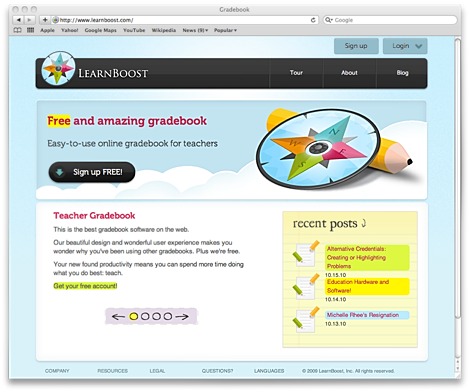
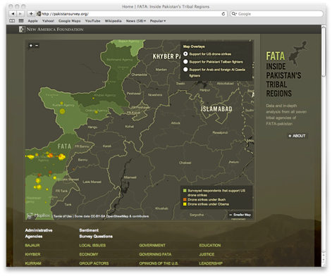
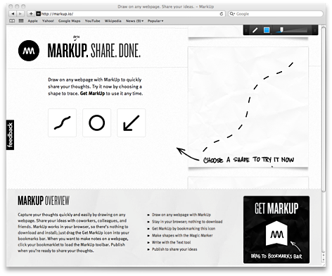
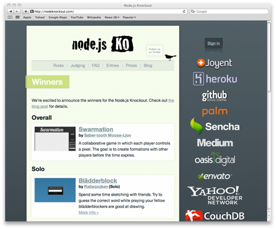
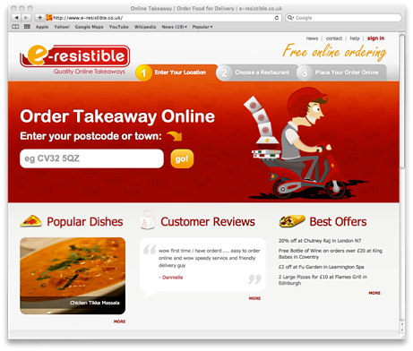

 

[Learnboost](http://learnboost.com) is a free online gradebook application, aimed to crush the competition with innovative, realtime, enjoyable features.

[Storify](http://storify.com) lets you turn what people post on social media websites into compelling stories.

[Pakistan Survey](http://pakistansurvey.org/) by [Development Seed](http://developmentseed.org), provides in-depth agency-specific analysis from regional experts with data from 1,000 interviews across 120 villages in all seven tribal agencies and mapping of 142 reported drone strikes in FATA through July 2010.

[Markup.IO](http://markup.io) allows you to draw directly on _any_ website, then share with others to share your thoughts.

[Scrabb.ly](http://scrabb.ly) is a massively multiplayer scrabble game initially created for the [Node Knockout](http://nodeknockout.com/) competition.

[ClickDummy](http://clickdummy.net/) is a rapid mockup prototyping application for designers and dummies.

[Node Knockout](http://nodeknockout.com) organized the first ever node-specific competition with hundreds of contestants.

[Widescript](http://widescript.com) is an innovative app that helps you focus and interact with your texts - on your desktop, your couch or on the go.

[e-resistable](http://www.e-resistible.co.uk/) is an online order takeaway system providing an intuitive way to fill your belly from your computer!

[Top Twitter Trends](http://toptwittertrends.com) utilizes MongoDB, Socket.IO, jQuery and many other exciting libraries to bring you trending tweets in realtime.

 

The applications shown above are not listed in any specific order. To have an application added or removed please contact [TJ Holowaychuk](http://github.com/visionmedia).